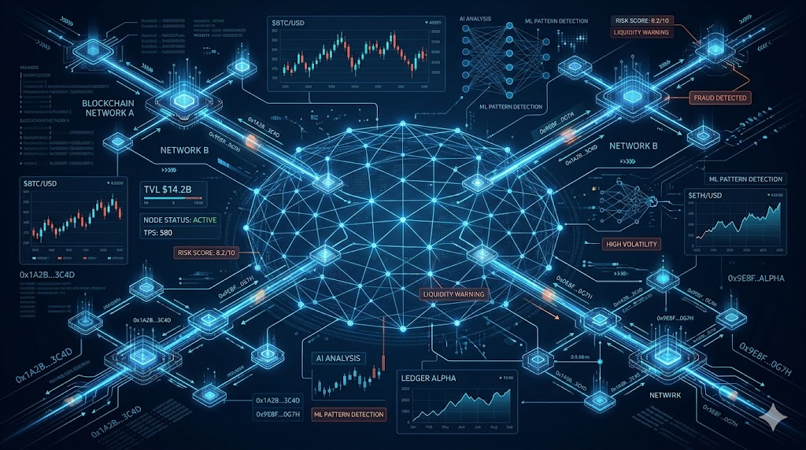

## **Executive Summary**

Onchain analysis reveals attack patterns weeks before they execute, but most teams only monitor known bad addresses while sophisticated threat actors route through thousands of intermediate wallets. With \$154 billion in illicit crypto activity in 2025 and nation-states operating industrial-scale laundering infrastructure, effective risk management requires understanding transaction graphs, temporal clustering, and cross-chain movement intelligence rather than static compliance checks.

## **Key Takeaways**

• Transaction graph analysis detects threats that address blacklists miss

• Temporal clustering patterns reveal attack preparation weeks in advance

• Cross-chain monitoring is essential as threat actors prioritize privacy over efficiency

• AI-powered platforms provide unified intelligence across multiple blockchains

• Human factors, not code vulnerabilities, represent the primary attack surface in 2026

### **The Article**

*When nation-states steal \$2 billion in a single year and DeFi exploits drain \$138 million in three months, knowing how to read onchain data goes from being optional to being a matter of survival*.

On February 21, 2026, the IoTeX cross-chain bridge lost millions to what security teams called a "sophisticated exploit." The reality was more embarrassing: anyone running proper transaction graph analysis would have flagged the attack wallet's behavior patterns two weeks earlier.

The attacker had been testing micro-transactions across bridge contracts, probing response times, and building transaction history to avoid fresh wallet detection. Classic reconnaissance behavior that shows up clearly in temporal analysis but gets missed by teams only watching known bad addresses.

This is 2026's central problem. Illicit cryptocurrency addresses received at least \$154 billion in 2025, representing a 162% increase year-over-year. North Korea alone stole \$2.02 billion in cryptocurrency in 2025. Meanwhile, DeFi protocols have suffered at least \$138 million in exploit losses just in the first quarter of 2026.

Every attack leaves forensic breadcrumbs before execution. The challenge isn't data availability—it's knowing which signals matter and building systems that process them before millions disappear.

## **What Professional Risk Analysis Actually Looks Like**

Real onchain risk analysis operates on transaction graph theory, not address blacklists. While most teams rely on static databases and manual reviews, sophisticated threat actors route funds through thousands of intermediate wallets using algorithmic dispersal patterns that make traditional monitoring useless.

Take North Korea's documented laundering methodology. DeFi protocols see the most dramatic increase (+370%) in stolen fund flows, serving as the primary entry point, followed by mixing services (+135-150%) creating the first layer of obfuscation. This is far from being a random criminal behavior; it's an industrial-scale financial engineering designed to exploit gaps in compliance frameworks.

Professional teams use platforms like OmniRisk to cut through this complexity. Instead of juggling multiple tools and databases, they get unified risk intelligence that tracks wallet behavior, liquidity concentration, and cross-chain movement patterns in a single dashboard. When OmniRisk flags a wallet with a risk score of 94/100 due to "liquidity fragmentation" and "bridge dependency," that's not abstract scoring, it's instead actionable intelligence based on the exact patterns North Korea uses.

## **Reading the Signals That Matter**

The most dangerous wallets aren't the ones on sanctions lists—they're the ones exhibiting behavioral patterns that precede major exploits. Here's what professional teams actually monitor:

**Temporal Clustering Detection**

When multiple dormant addresses suddenly activate, receive similar transaction amounts, or interact with the same DeFi protocols within tight timeframes, you're seeing operational preparation. The IoTeX bridge exploit followed this pattern exactly: the attack wallet had been receiving small transfers for six weeks, building transaction history while twelve secondary addresses received test transactions on identical schedules.

OmniRisk's anomaly detection catches these patterns automatically. When their system flags "whale concentration increased" or "liquidation sensitivity," it's identifying the exact coordination signals that manual analysis misses.

**Cross-Chain Movement Intelligence**

Bridge services see heavy reliance (+97% difference) as threat actors attempt to move assets between blockchains and complicate tracing. Professional teams distinguish between legitimate arbitrage and deliberate obfuscation by tracking routing optimization patterns that criminal operations use to prioritize privacy over efficiency.

This is where OmniRisk's cross-chain monitoring becomes critical. Their platform tracks 6 chains simultaneously with sub-60-second alert latency, meaning you see suspicious bridge activity as it happens, not when it's already too late.

**Smart Contract Risk Signals**

Flash loan attacks surged in 2024, making up 83.3% of eligible exploits, while off-chain attacks accounted for 80.5% of stolen funds. The most expensive attacks aren't exploiting Solidity bugs anymore—they're targeting governance mechanisms, oracle feeds, and admin key security.

When OmniRisk shows a "privileged contract controls" risk at Medium level with 16% contribution to overall risk, that's highlighting exactly these governance vulnerabilities that traditional code audits miss.

**The Human Factor Problem**

On-chain security is improving dramatically, but the main attack surface in 2026 will be people, with the human factor now the weak link. Social engineering attacks targeting key management have proven more profitable than code exploits, creating a paradox where technical security improves but overall risk increases.

Over 90% of projects still have critical, exploitable vulnerabilities, and even where defensive tooling exists, adoption is thin. This is why platforms like OmniRisk focus on operational intelligence rather than just technical scanning. Their alert system doesn't just flag risks—it provides "human-readable risk narratives" that explain what the data means and what actions to take.

## **AI-Powered Detection at Machine Speed**

AI will change the tempo of security on both sides—defenders will rely increasingly on AI-driven monitoring and response that operates at machine speed, while attackers use the same tools for vulnerability research and social engineering at scale.

OmniRisk's approach exemplifies this evolution. Their OmniScore provides a single headline number backed by inspectable signals—liquidity stress, whale concentration, behavior anomaly—that updates in real-time as market conditions change. Instead of overwhelming analysts with raw data, the system provides "analyst-friendly summaries that explain the signal without hiding the underlying evidence."

When their dashboard shows "liquidation down 41% in 6h" as a critical alert, that's not just a number—it's an AI-driven analysis of cross-chain pool depth that detected sharply raised liquidation sensitivity across multiple protocols simultaneously.

## **Strategic Intelligence for Professional Teams**

The crypto threat landscape has fundamentally shifted. Russia's ruble-backed A7A5 stablecoin processed \$93.3 billion in transactions within less than a year, functioning as a dedicated settlement system for sanctioned Russian businesses. Iran uses cryptocurrency infrastructure to finance regional militia networks, with addresses associated with IRGC facilitation networks accounting for over 50% of total value received by Iranian services.

Professional risk management must evolve from reactive monitoring to predictive intelligence. Understanding these operations requires platforms that can process transaction graphs at scale while maintaining the analytical depth needed for investigative work.

The future belongs to organizations that treat onchain analysis as core business intelligence rather than compliance overhead. OmniRisk represents this approach—combining token risk scoring, wallet intelligence, and cross-chain market context into workflows designed for professional decision-making under pressure.

Effective onchain risk analysis isn't about perfect detection. It's about building intelligence capabilities that provide operational advantage over constantly evolving threat actors. In a financial system built on programmable transparency, the ability to read blockchain data professionally determines competitive advantage.

## **The Bottom Line**

Onchain analysis sits at the center of crypto risk management, institutional compliance, and DeFi security. But watching addresses without understanding behavior patterns is not intelligence. It is reactive monitoring disguised as proactive defense.

The right questions are straightforward. What behavioral patterns preceded the last major exploit? How do professional threat actors actually move funds? Does your system detect cross-chain obfuscation techniques? And when attack patterns evolve tomorrow, will you see them coming?

Most teams cannot answer all four. The ones that can are not just doing compliance screening. They are doing predictive risk intelligence, and that difference shows up in prevented losses, faster incident response, and competitive advantage in an increasingly hostile environment. More information can be found in [https://rayachain.omnirisk.io]
