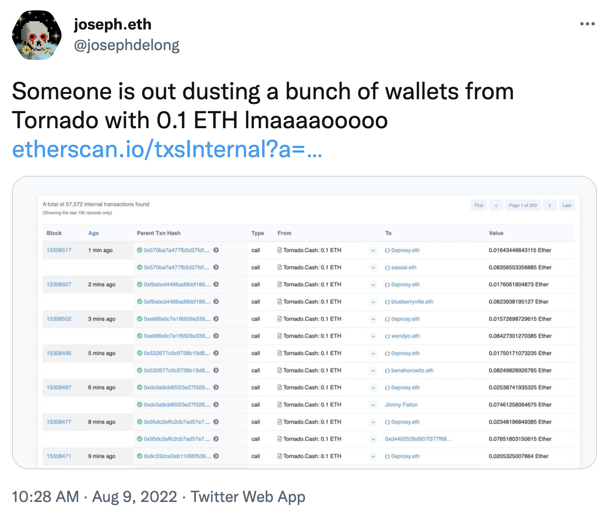
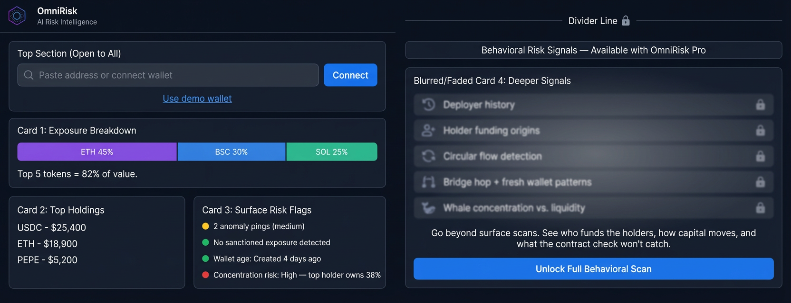
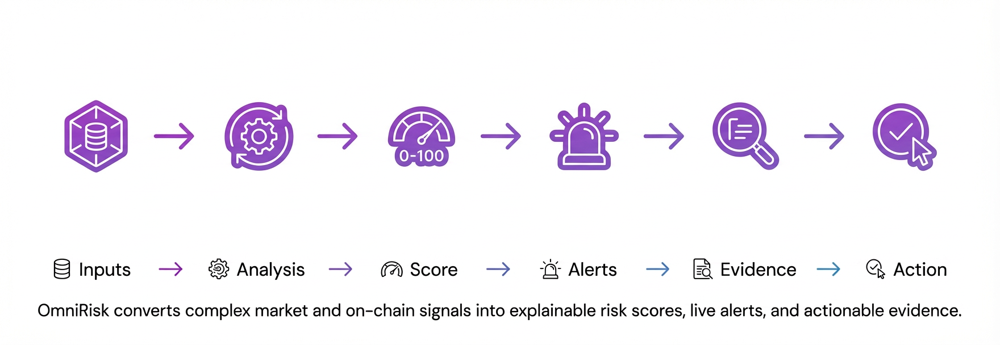

*Following the AML/OFAC [<u>sanctions</u>](https://home.treasury.gov/news/press-releases/jy0916) on the crypto mixer Tornado Cash, it didn't take long for trolls to send contaminated 'dust' to addresses tied to public figures. As a result, innocent users had their addresses frozen, blacklisted and flagged with the same severity as wallets that actively funded scams.*

*This raises a key question: How do we assess trust in DeFi when risk is rarely binary?*

*To answer this, we must look at advanced scoring models, where transaction histories, counterparty exposure, and behavioral anomalies are analyzed as a whole.*

*This guide breaks down exactly what wallet risk scores measure, where traditional tools fall short, and how a more contextual approach can improve interpretation.*

 [*<u>ETH dust contamination case</u>*](https://twitter.com/josephdelong/status/1557011056572129280)

## What Is a Crypto Wallet Risk Score?

A crypto wallet risk score combines several signals, including transaction history, exposure to flagged or sanctioned entities, specific behavioral patterns, and its relationship to its broader network.

In permissionless markets, the only thing standing between safety and scam is the ability to accurately and quickly analyze how risky a wallet is.

## Who Benefits From Wallet Risk Scores?

Compliance teams use wallet risk scores to screen counterparties before settlement. Market makers use them to avoid toxic flow. Retail investors and active traders also benefit by filtering out counterparties tied to exploits or fraud before committing capital to new protocols.

In short, it helps anyone in DeFi answer one question before it's too late: Is this address safe to touch?

## How Is a Wallet Risk Score Calculated?

The reputation scoring relies on several analytical layers. While the exact metrics, naming conventions, and weightings will depend on the platform, at its core, wallet analysis always begins with on-chain transaction history.

Here is how standard on-chain behaviors translate into the specific metrics that make up a wallet's overall reputation:

- **Transaction History & Counterparty Quality:** Repeated interactions with flagged entities (think [<u>OFAC-sanctioned addresses</u>](https://github.com/0xB10C/ofac-sanctioned-digital-currency-addresses?tab=readme-ov-file)), darknet markets, or mixers will severely damage a wallet’s reputation score, dragging down its *Counterparty Quality* and *Exposure Hygiene*. Conversely, sustained, normal activity with reputable venues and verified contracts strengthens the score.

- **Wallet Age, Funding Origin:** A wallet that is years old with consistent activity presents a very different profile than one funded yesterday from a suspicious source.

- **Behavioral Anomalies & Consistency:** Unusual patterns, such as rapid fund movements between multiple accounts, bot-like transaction spam, or large transfers with no clear economic purpose, signal suspicious behavior.

- **Cross-Chain Movements & Liquidity Risk:** Tracking how funds bridge between chains can indicate attempts to evade detection or disperse assets. Engaging in complex, obfuscated bridging, or interacting with unverified/high-risk liquidity pools, will drag down the wallet's score.

\
-

## What Does Your Wallet Risk Score Mean?

To create a reliable metric, raw data is processed and recalculated so users can easily interpret it. Behind the scenes, the calculated signals are weighted by reliability and calibrated into a standardized 0–100 reputation score, alongside a confidence level.

Confidence indicates how much usable evidence exists behind the score. That means identical scores can require different interpretations depending on the quality and depth of the underlying data.

To make sense of the data, it helps to follow this standardized grading system:

- **76–100 (Excellent / Low Risk):** Strong on-chain reputation and hygiene.

- **51–75 (Stable but Watchlisted / Moderate Risk):** Generally stable, but exhibits some mixed signals.

- **21–50 (Poor / High Risk):** Concerning on-chain behavior.

- **0–20 (Severe Risk / Untrusted):** Highly suspicious or malicious behavior.

## What Most Tools Won’t Tell You (The False Positive Problem)

The biggest danger in crypto wallet risk scoring is the sheer volume of false alarms. Excessive false positives trigger a "Boy Who Cried Wolf" effect: reviewers lose confidence in the system, legitimate threats get deprioritized, and genuine vulnerabilities slip through the cracks.

Standard blockchain analytics tools rely on blunt heuristics that create this exact problem. Here is what they usually miss:

### New Wallet Addresses Aren't Always Malicious

Many wallet screening systems penalize newly created addresses by default. However, legitimate users constantly create fresh accounts for OPSEC, privacy, or portfolio segmentation. Relying solely on the metric of age creates unnecessary red flags.

### Indirect Exposure Requires Context

A single transaction hop from a mixer or compromised address does not equal malicious control. Standard tools often assign a penalty without considering on-chain hop depth or timing, even though those details help distinguish active involvement from passive exposure.

### Infrastructure Creates False Alarms

DeFi infrastructure such as bridges, DEX routers, and exchange addresses process millions of transactions. If a sanctioned entity uses the same bridge as you, a standard scanner may flag both wallets, even if the only shared link is a high-volume smart contract.

### Risk is a Moving Target

A static score has limited value if a wallet’s behavior turns malicious an hour after the scan. Risk is dynamic, and single-moment snapshots fail to capture sudden, post-scan ill-intent activity.

Wallet risk depends on context: *how* funds move, *who* they move with, and whether those patterns are persistent or incidental. That's exactly what most tools are built to ignore and what [<u>OmniRisk</u>](https://omnirisk.io/wallet) is built to surface.

## The Difference Context Makes: A Real-World Scenario

Let's look at how a blunt tool and a contextual one handle the exact same wallet. Imagine a two-year-old address with a consistent trading history that suddenly receives 0.1 ETH in unsolicited dust from a sanctioned Tornado Cash address.

To a traditional screening tool, this wallet is flagged with a score of 15/100 **(Severe Risk)**. The system sees a direct 1-hop transaction from a sanctioned entity and triggers an automatic blacklist. No context. No questions asked.

OmniRisk, however, assigns an OmniScore of 68/100 **(Moderate / Watchlisted)**. It recognizes the incoming transaction as low-value, unsolicited, and consistent with a known dusting pattern. Instead of a blind freeze, compliance receives a dynamic watchlist alert and the legitimate user keeps trading.

*Same wallet. Same transaction. Two very different outcomes.*

## How OmniRisk Helps Interpret a Wallet Risk Score

OmniRisk is designed to supplement blunt metrics with contextual analysis, while OmniScore summarizes that analysis into an interpretable risk signal. Here is how it helps you go deeper:

### Confidence Gives the Score Meaning

Two wallets can receive similar scores for very different reasons. A long-active wallet with one indirect exposure may deserve a very different interpretation than a newly funded wallet with sparse history. Confidence helps users understand how much evidence exists behind the score and whether the result should be treated as a strong signal or only an early warning.

### Dynamic Alerting, Not Just Post-Hoc Reporting

A wallet score is a point-in-time assessment. OmniRisk helps teams [<u>monitor</u>](https://omnirisk.io/alerts) shifts in counterparty quality, exposure hygiene, and behavioral consistency catching warning signs before risk compounds.

## What to Do If a Wallet Looks Risky?

If a wallet receives a moderate- or high-risk score, don’t stop at the number — examine the context behind it. Paste the address into OmniRisk to uncover the exact reasons for the score, including on-chain links, liquidity signals, and historical behavioral shifts.

Once you have the supporting evidence, your team can decide how to respond. OmniRisk does not replace human due diligence; it supports faster, more informed screening.

Whether that means reducing exposure, delaying entry, or adding the wallet to an automated watchlist, you get the team-ready reporting needed to act with confidence.

**Ready to see the full picture? Paste a crypto address into OmniRisk to generate an OmniScore and review the supporting context. [<u>Start for free</u>](https://omnirisk.io/pricing), and upgrade when continuous monitoring becomes essential to your workflow.**

# Outline

**Working Title:** Wallet Risk Score Explained: What the Numbers Actually Mean (And What Most Tools Don’t Tell You)

**Suggested Keyword:** Crypto wallet risk score\
**Detailed Outline:**

**H1:** Wallet Risk Score Explained: What the Numbers Actually Mean (And What Most Tools Don’t Tell You)

- **H2:** What Is a Crypto Wallet Risk Score?

- **H2:** Who Benefits From Wallet Risk Scores?

- **H2:** How Is a Wallet Risk Score Calculated?

  - *H3:* Transaction History & Counterparty Quality

  - *H3:* Wallet Age, Funding Origin

  - *H3:* Behavioral Anomalies & Consistency

  - *H3:* Cross-Chain Movements & Liquidity Risk

- **H2:** What Does Your Wallet Risk Score Mean?

- **H2:** What Most Tools Won’t Tell You (The False Positive Problem)

  - *H3:* New Wallet Addresses Aren't Always Malicious

  - *H3:* Indirect Exposure Requires Context

  - *H3:* Infrastructure Creates False Alarms

  - *H3:* Risk is a Moving Target

- **H2:** How OmniRisk Helps Interpret a Wallet Risk Score

  - *H3:* Confidence Gives the Score Meaning

  - *H3:* Dynamic Alerting, Not Just Post-Hoc Reporting

- **H2:** What to Do If a Wallet Looks Risky?

# Q1: How would you structure an article for the query “is this token safe?” so it both ranks and leads users to OmniRisk? 

Suggested outline:

**H1: Is This Token Safe? What to Check Before You Buy**

- **The "TL;DR" Featured Snippet Block:** A bulleted list at the very top answering the query directly (e.g., "To know if a token is safe, check: 1. Contract renouncement, 2. Liquidity locks, 3. Holder distribution, 4. Developer wallet history.").

**H2: What “safe” means in crypto**

**H2: The basic token safety checklist: The 4 Manual Checks Every Trader Must Do**

- Explain how to check liquidity pools, read basic contract scanners, and check Etherscan.

**H3: Why Manual Checks Are No Longer Enough**

- Explain that scammers know how to bypass basic scanners. A contract might look safe, but the wallets holding the supply might be malicious.

**H2: How to Deep-Scan a Token in Seconds**

- Show how OmniRisk doesn't just scan the *contract*, but uses AI to scan the *wallets* holding the token, tracking whale movements and hidden developer clusters.

**H2: Real-World Example: A "Safe" Token That Rugged**

- A mini-case study of a token that passed basic scanners but was flagged by OmniRisk's behavioral analysis.

**H2: How to use OmniRisk to evaluate wallet and token risk**

- Why anomalies and concentration change the risk picture

- Final checklist before buying

## Conversion path into OmniRisk

Article to move readers through this sequence:

**search query → checklist → limitations of scanners → hidden wallet risks → OmniRisk as the solution**

# Q2: What are 3 important risks that a normal token scanner usually misses?

**Unexplainable "Black Box" Threats**

Normal scanners often just spit out a generic 0–100 score or a vague AI summary, leaving users blind to the actual threat. OmniRisk provides the exact reasons and on-chain proof. It tells you what changed, why it matters, and where to investigate next.

**Human Manipulation Hiding Behind Clean Code**

Standard tools only read smart contract code to find hard-coded scams (like high taxes), missing behavioral risks entirely. OmniRisk combines these deterministic code checks with advanced behavioral models, i.e., tracking holder graphs, whale clusters, and anomaly bursts, to catch sophisticated human manipulation that clean code hides.

**Sudden, Post-Scan Malicious Activity**

Most tools only scan a token at the exact moment you search for it, meaning they miss delayed rug pulls or attacks. OmniRisk actively monitors for shifts in risk over time (deltas). If liquidity suddenly drains or holder behavior flips, it emits real-time alerts with severity rankings and timestamps.
