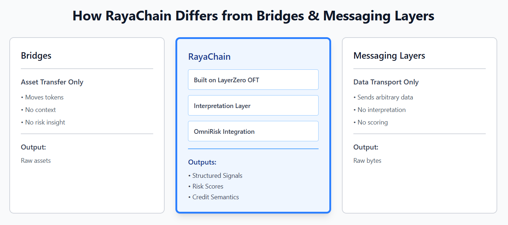
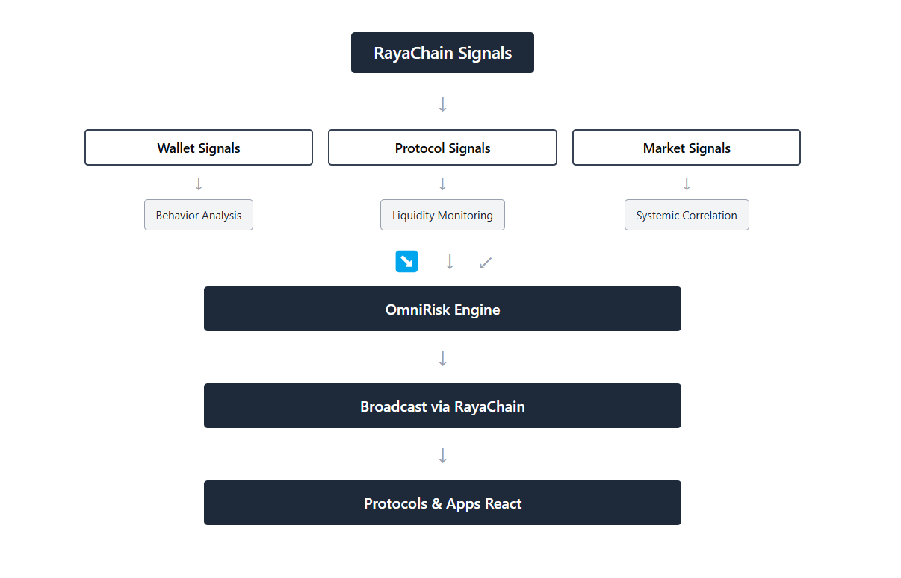

# **RayaChain as a Canary Layer: Broadcasting Risk and Credit Signals Across Chains**

*Risk in crypto is not absent. It is fragmented.*

The current state of blockchain technology is that each blockchain maintains its own state, while wallets can operate across multiple networks simultaneously. Liquidity can move through bridges in a matter of seconds. However, the important information that should accompany this movement, such as who the wallet belongs to, its past behavior, and the risks it carries, remains isolated. This information resides on the blockchain where it was created, making it invisible to others even when they interact with it.

This is the central issue that RayaChain aims to solve. It doesn't focus on bridging assets or transmitting generic messages, rather, it is about distributing something more challenging to move: context.

To understand its purpose, it's important to view RayaChain as a canary layer – an early warning network designed to detect risk signals before they lead to visible consequences.

## What a Canary Layer Does

Just like in a coal mine, the canary detects gas leaks early, allowing miners to take action before the issue escalates. In on-chain systems, risk management is often reactive, such that lending protocols act only after collateral falls below a threshold, and exchanges identify fraud post-transfer. Critical information exists but isn't accessible in time for preventive measures.

A canary layer continuously monitors wallet behavior, liquidity patterns, and anomalies, sending alerts before failures or exploits occur. The value lies in distributing this analysis across systems that can act on it.

RayaChain is designed for this purpose. OmniRisk generates intelligence by scoring wallets and tracking risk exposure, enabling lending protocols on different blockchains to gain insights about wallet activity across networks like Arbitrum, Base, and Ethereum mainnet.

## **Why Risk Intelligence Does Not Travel**

The infrastructure for moving value cross-chain is well-developed. Bridges, (Omnichain Fungible Token) OFT standards, and interoperability protocols handle billions of dollars in transfer volume. However, the infrastructure for transferring meaning across chains is almost non-existent.

As we know, credit history is specific to each chain. Consider a wallet that, over 72 hours, does the following:

- rapidly unwinds a leveraged position on a Base lending protocol,

- bridges the proceeds to Arbitrum

- opens a new borrowing position on Arbitrum, this time with lower quality collateral.

To the Arbitrum protocol, this wallet is new. No local history. No red flags visible. It sees an address requesting a loan, checks the collateral ratio, and the parameters pass. The loan is approved.

What the protocol cannot see, without a cross-chain signal layer, is that this wallet just deleveraged aggressively on another chain, a behavioral pattern that correlates strongly with incoming stress or deliberate risk-shifting. That signal existed. It was simply trapped on Base.

With RayaChain broadcasting OmniRisk's analysis, the Arbitrum protocol receives the wallet's cross-chain risk profile before the position is opened. It now has a decision to make: require additional collateral, reduce the maximum loan size, or decline the position entirely. The signal did not prevent anything automatically. It changed what the protocol knew before it acted.

This highlights the practical difference a canary layer makes, which is enabling informed decision making precisely when it matters.

## **How RayaChain Differs from Bridges and Messaging Layers**

The distinction is important because RayaChain is built on LayerZero OFT, which might make it seem like it functions as a bridge or a generic messaging protocol. However, it is neither of those.

Traditional bridges transfer assets from one blockchain to another without conveying any semantic meaning. A bridge does not know why funds are moving, who is transferring them, or what that movement might indicate regarding risk.

On the other hand, generic cross-chain messaging layers transmit arbitrary data. They serve solely as infrastructure capable of moving bytes between chains, but they remain indifferent to the meaning of that data. They lack an opinion layer, interpretation, or scoring.

RayaChain uses LayerZero OFT as its transportation method but adds something that neither traditional bridges nor messaging layers provide: an interpretation layer that includes risk and credit semantics. These signals come from OmniRisk's analysis, which are structured, scored, and ready for use by downstream protocols and applications. The interpretation has already been done. The receiving system does not get raw behavioral data and a problem to solve. Instead, it gets a risk assessment and a basis for decision-making.

## **What Gets Broadcast**

The signals RayaChain distributes fall into three broad categories, each operating at a different level of abstraction.

**Wallet-level signals**

Behavioral shifts at the wallet level. Sudden deleveraging, rapid cross-chain fund movement, and changes in repayment patterns are among the most reliable early indicators of incoming stress. These signals are generated from observed on-chain behavior and compiled into credit and risk profiles that can travel with a wallet across ecosystems.

**Protocol-level signals**

Liquidity instability, collateral stress, and abnormal usage patterns within a protocol generate signals that are often invisible to every other protocol in the ecosystem. A lending protocol experiencing unusual withdrawal velocity on one chain can broadcast that signal so that connected protocols elsewhere can adjust their own parameters accordingly.

**Market-level signals**

Correlated withdrawals across multiple protocols, unusual bridge flow patterns, and coordinated deleveraging within a specific asset class can indicate systemic stress before any individual failure occurs. These signals require visibility across multiple chains at the same time, which is exactly what a cross-chain signal layer provides.

All three signal types share common characteristics: they are time-sensitive, probabilistic rather than binary, and require context to interpret correctly. Analysis happens once inside OmniRisk. Awareness then becomes available network-wide.

## What OmniRisk Actually Surfaces

RayaChain distributes signals, while OmniRisk produces them. The value of the transport layer relies on the quality of its content.

OmniRisk generates dynamic wallet risk profiles based on on-chain behavior, such as leverage history and repayment patterns, with updates reflecting recent activities and changes in behavior. It also tracks cross-chain activity, providing a comprehensive risk analysis that individual chains may miss. OmniRisk identifies early warning signs of potential protocol failures, like unusual withdrawal velocity and collateral concentration, enabling proactive risk management.

The common thread across all three outputs is that they are evaluated, not raw. A protocol or exchange receiving an OmniRisk signal via RayaChain does not receive a data dump to interpret. It receives a scored, structured assessment with a clear basis for a decision. That is what makes the signal useful at the speed onchain systems operate. None of this replaces a protocol's own risk parameters or a user's own judgment. It supplements them with cross-chain context they would otherwise lack entirely.

## 

## **Practical Implications by Audience**

The value of cross-chain risk intelligence is not abstract. It changes specific decisions for specific actors across the ecosystem.

**1. For protocols**

Lending protocols can adjust collateral requirements dynamically based on the cross-chain risk profile of a borrower, not just their local history. A wallet flagged for high-risk behavior on one chain no longer arrives at another lending market as an unknown entity. The protocol receives evaluated context and can respond with tighter parameters, reduced credit limits, or denied access before a position goes bad.

**2. For exchanges**

Deposit screening and withdrawal monitoring benefit directly from cross-chain behavioral data. An exchange that can see a wallet's pattern of behavior across multiple networks, not just its activity on the exchange itself, can detect potential fraud, exploitation activity, or wash trading earlier and with higher confidence.

**3. For investors and analysts**

Capital movement across chains, analyzed in aggregate rather than in isolation, reveals patterns that chain-specific analytics miss entirely. Coordinated deleveraging across multiple protocols and chains, unusual concentration of high-risk wallets in a specific liquidity pool, or early signs of a stress cascade in a particular asset, these become visible when intelligence travels across ecosystems.

**4. For users**

Cross-chain credit visibility means that a user's on-chain track record, such as repayment behavior, risk management, duration of clean history, can follow them across ecosystems. A user with a strong credit profile on one chain does not start from zero on the next. Their reputation becomes portable, which opens better terms, higher limits, and more favorable protocol interactions wherever they go.

## **What This Points Toward**

RayaChain marks a significant shift in the cryptocurrency landscape by focusing on risk coordination, a neglected area. Current protocols lack complete participant information, causing credit resets at chain boundaries and localized risk signals.

For advancements in on-chain credit markets, undercollateralized lending, and cross-chain financial products, a cross-chain signal layer is essential for sharing evaluated intelligence across ecosystems.

RayaChain enables the movement of RAYA and shares OmniRisk signals, laying the groundwork for future developments like RAYA subscriptions, cross-chain entitlements, and external trust feeds.

The canary layer metaphor highlights that the true value of RayaChain lies not only in the quality of OmniRisk's analysis but also in its accessibility wherever on-chain activity takes place. An interconnected financial system requires equally interconnected risk infrastructure.

<u>Notes</u>

Written for: crypto users, analysts, protocol builders, and investors who understand basic DeFi mechanics but are encountering RayaChain for the first time.

Search intent / SEO angle: Cross-chain risk intelligence, omnichain infrastructure, LayerZero use cases beyond bridging, onchain credit portability, crypto risk signals.

Assumptions made: Reader understands wallets, bridges, lending protocols, and L2s at a conceptual level. Reader has no prior exposure to OmniRisk or RayaChain specifically.
