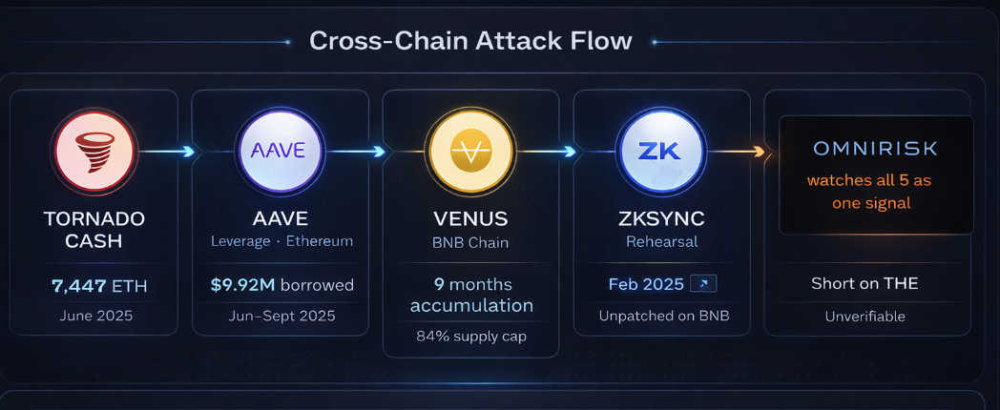
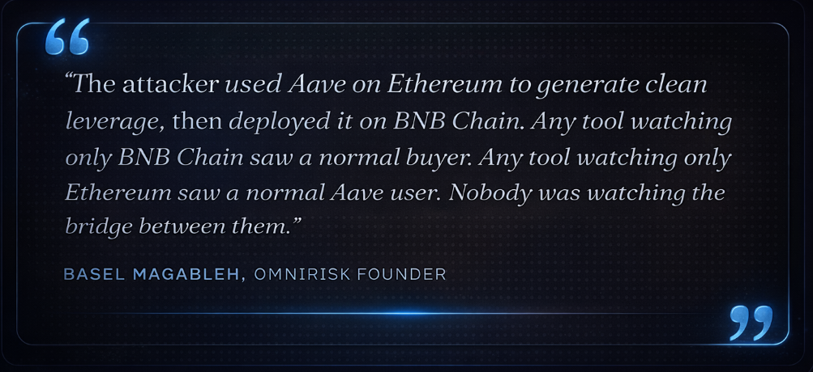
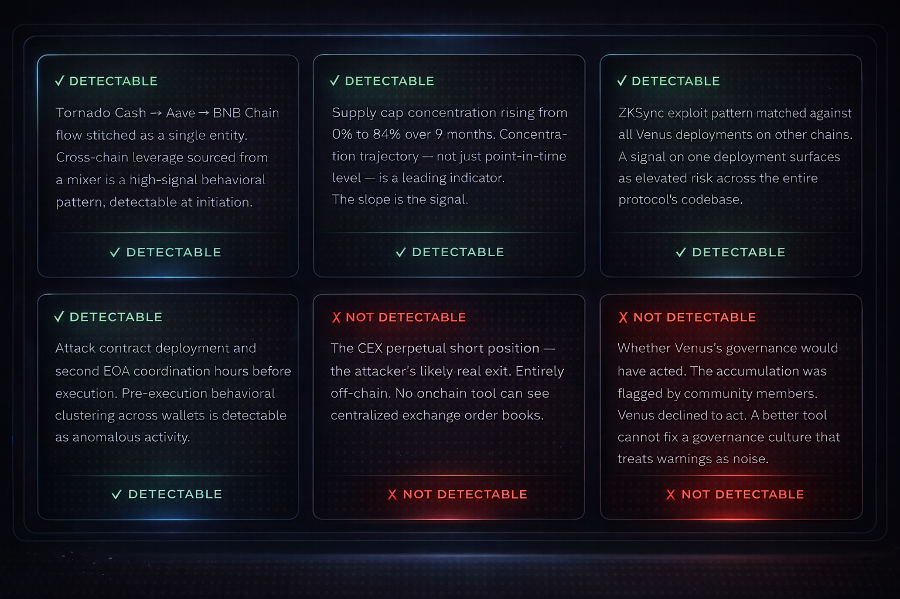

**Title: Why Most DeFi Risk Tools Have a Blind Spot\**
\
*Subtitle: The Venus Protocol exploit had a 10-week warning window. The attacker slowly built their position across five chains, and the signals were there the whole time. We just needed the right tool that could connect the dots.*

Venus Protocol, the largest lending platform on BNB Chain, was hit by a [<u>supply cap manipulation attack</u>](https://rekt.news/venus-protocol-rekt4) on March 15th, 2026.\
\
The bad actor extracted \$3.7 million methodically, executing the plan across five chains over nine months. It was the protocol's fourth major incident since 2021. And every step of the preparation was visible onchain.

The attack was rehearsed once on ZKSync, funded through Ethereum, levered through Aave, and executed on BNB Chain. The signals were there the whole time but no tool was stitching them across chains.

**Why single-chain monitoring missed all of it**

Most DeFi risk monitoring tools watch one chain. They alert on labeled addresses and match known bad patterns: mixers, blacklisted wallets, known exploit contracts. None of those approaches were sufficient here.

**1 - The labeling problem\**

The attacker's address was not labeled. It was a fresh wallet, funded through Tornado Cash, that had never done anything wrong before. By the time community members flagged it as suspicious, it had already been accumulating for months.

Behavioral flow analysis (detecting what a wallet is doing, not who it is) is the most reliable approach to catching this early. This is the distinction [<u>OmniRisk</u>](https://omnirisk.io/) is built around: flows, not labels.\
\
The question isn't "is this wallet flagged?" It's "does this wallet's behavior, across all chains where it's active, match a known pre-attack pattern?" Those are entirely different questions, with entirely different detection timelines.

**2 - The cross-chain stitching problem**

The Ethereum funding activity and the BNB Chain accumulation were treated as unrelated by any tool watching only one of those chains.

[<u>RayaChain</u>](https://omnirisk.io/rayachain), OmniRisk's unified cross-chain data layer, is built to treat multi-chain wallet clusters as single entities regardless of which chains they're active on.\
\
When an address that received funds from Tornado Cash deposits into Aave and bridges stablecoins to BNB Chain, those three events collapse into one behavioral signal, not three unrelated ones shown on separate dashboards.

**3 - The ZKSync precedent was invisible to BNB Chain monitors**

The most painful missed signal: the February 2025 ZKSync exploit was the most direct possible warning that BNB Chain was next. Same codebase, same vulnerability class, same protocol. But there was no mechanism to propagate that risk signal from ZKSync to BNB Chain automatically.

This is precisely the cross-protocol risk propagation OmniRisk is designed to surface. A risk event on one Venus deployment is a risk signal for every Venus deployment on every chain. RayaChain's architecture models protocol-level risk: when an exploit pattern is detected on ZKSync, the same signal informs risk scoring across related deployments of the same codebase, with fully automated cross-chain elevation still in development.\
\
This wasn't a newly discovered weakness: a [<u>Code4rena audit</u>](https://code4rena.com/reports/2023-05-venus) of Venus from 2023 had documented it under finding M-10, "Exchange Rate can be manipulated," with a working proof of concept. The team dismissed it as "an intentional feature with no negative side effects." The ZKSync exploit proved otherwise, all while BNB Chain was still running the same unpatched code.

**What cross-chain flow intelligence catches (and what it doesn't)**

**The actionable window:** Cross-chain flow analysis could have generated a high-severity signal no later than January 2026, when single-entity concentration crossed 60% of the \$THE supply cap (native token of Thena DEX), a full 10 weeks before execution.

**What cross-chain intelligence cannot do**

- **It cannot override governance inaction:** Venus had community flags, a live prior exploit, and a dismissed audit finding. None triggered remediation. Better tooling generates better signals, but it cannot force the decision to act on them.

<!-- -->

- **Alert fatigue is a system risk, not just a tooling one:** The attacker operated within the rules for 9 months. A monitoring system calibrated to catch behavioral anomalies, not just rule violations, will produce signals that look like false positives until they aren't. Protocols need risk response processes built for probabilistic warnings, not just confirmed exploits.

**Five takeaways from the Venus incident**

For protocols, investors, and risk teams operating across chains.

**1 - The cross-chain trail is the attack**

The operation spanned five chains. Watching any single one gave a non-alarming picture. The signal only exists when you stitch the full flow into one behavioral entity.

RayaChain stitches multi-chain wallet clusters into single entities, with real-time coverage continuously improving. The full Tornado Cash → Aave → BNB Chain trail could have appeared as a single risk entity early in the flow.

**2 - Flows, not labels, are your earliest warning**

The attacker's wallet was unlabeled for the entire 270-day window. Label-based monitoring is reactive by design. Behavioral flow analysis detects the trajectory before any database flags the destination.

Flow-based behavioral scoring flags wallets based on what they do across chains, not who they are. OmniRisk could have scored this address as high-risk within weeks of the first Aave borrow, long before any label existed.

**3 - A risk signal on one deployment is a signal for all deployments**

The February 2025 ZKSync exploit was the most explicit possible warning that BNB Chain was next. When a vulnerability is confirmed on Chain A, every other deployment of the same codebase should show elevated risk signals across deployments.

Protocol-level risk propagation via RayaChain means exploit patterns on one deployment inform risk scoring across related deployments of the same codebase. The ZKSync exploit likely would have flagged Venus BNB Chain as elevated risk in February 2025, not March 2026.

**4 - Collateral concentration trajectory matters more than collateral concentration level** The attacker reached 60%, then 70%, then 84% of Venus's \$THE supply cap over months. A system watching trajectory can generate an alert weeks before any fixed threshold is crossed.

OmniRisk's behavioral scoring already partially captures concentration trajectory through its cross-chain monitoring layer. Explicit rate-of-change alerting (flagging the slope of accumulation, not just the level) is actively being built toward as a dedicated feature.\
\
**5 - Know what your tools cannot see\**
CEX perp positions and governance inaction are genuine blind spots. Cross-chain intelligence reduces the detection window, but it does not eliminate it. Treat it as a leading indicator, not an oracle.

Every OmniRisk alert includes a confidence score and a propagation path. The goal is to give risk teams enough context to make a decision, not to replace the decision itself.\
\
**Final takeaway:** The Venus attack had four detection windows across nine months. The data existed but the tools to read it didn't. That's the problem OmniRisk is built to solve.

**SEO metadata**

**Slug:**

/blog/defi-risk-tools-blind-spot-venus-protocol-2026

**Meta title** (under 60 chars):

Why Most DeFi Risk Tools Have a Blind Spot \| OmniRisk

**Meta description** (under 155 chars):

The Venus Protocol exploit had a 10-week warning window across five chains. Here's what cross-chain flow intelligence catches that single-chain tools miss entirely.

**Focus keyword:**

cross-chain DeFi risk monitoring

**Secondary keywords:**

Venus Protocol exploit 2026

DeFi blind spot

onchain flow analysis

supply cap manipulation

donation attack DeFi

Compound fork vulnerability

pre-label wallet detection

RayaChain OmniRisk

**Tags** (for CMS):

DeFi Security · Exploit Analysis · Cross-Chain Risk · Onchain Intelligence · Venus Protocol · BNB Chain · Compound Fork · OmniRisk Research

**Category:**

Research → Exploit Post-Mortems
